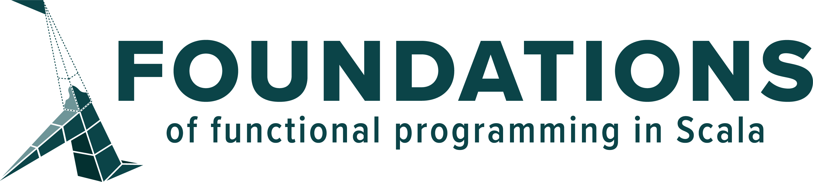

  

Foundation of Functional Programming in Scala is a comprehensive, self-paced online course with no prerequisites, which 
helps you to become a confident, productive, and powerful functional Scala developer.

## Requirements

Some basic understanding of Scala syntax.

## Course Synopsis

## 1. Value functions

In this section, we'll do a deep dive into the different types of functions available in Scala. 
We’ll discuss what the difference is between them and when we should use each one.

### Objectives
* Learn the difference between methods and lambdas
* Learn to generalise a common pattern with a higher-order function
* Discover property-based testing and common testing techniques
* Learn the various syntaxes for functions including the use of `_` (the underscore character)

### Slides
1. [Val vs Def functions](https://fp-tower.github.io/foundations/value-functions/val-vs-def-functions.html#1)
1. [Function as inputs](https://fp-tower.github.io/foundations/value-functions/function-as-inputs.html#1)

## 2. Generic functions

In Scala, we make functions and data types generic by adding type parameters. This simple technique 
has a tremendous impact on the design of functional APIs and we'll use it extensively throughout 
the course. In this section, we will learn how to read and implement interfaces using generic types 
as well as how to avoid the common pitfalls related to type parameters.

### Objectives
* Use type parameters to write fewer and more efficient tests
* Understand why we shouldn't pattern match on a generic value
* Practice working with Scala type inference
* Learn how to use triple question marks and type parameters to guide the implementation of functions
* Practice the design of functional APIs
* Learn how to create and use custom random generators for property-based testing

### Slides
1. [Generic functions - part 1](https://fp-tower.github.io/foundations/generic-functions/generic-functions-part-1.html#1)
1. [Generic functions - part 2](https://fp-tower.github.io/foundations/generic-functions/generic-functions-part-2.html#1)

## 3. Parallel data processing

Modern applications need to process more and more data in a short amount of time, which has led 
to the creation of technologies such as MapReduce, Spark and Kafka. In this section, we will 
cover the fundamentals of parallel data processing and learn why functional programming is such 
a good fit for it. We'll conclude this module with the analysis of a real-world dataset on global 
average temperature.

### Objectives
* Learn how to use generic types and property-based testing to explore a problem
* Understand the risks of recursive functions
* Familiarise yourself with foldLeft, foldMap and Monoids
* Identify the difference between parallel and concurrent programs
* Work with Future from the Scala standard library

### Slides
1. [Introduction](https://blog.fp-tower.com/foundations/data-processing/parallel-data-processing.html#1)
1. [Iteration with for loops](https://fp-tower.github.io/foundations/data-processing/iteration-with-for-loops.html#1)
1. [Recursions](https://fp-tower.github.io/foundations/data-processing/recursions.html#1)
1. [Analysis of global temperature - part 1](https://fp-tower.github.io/foundations/data-processing/analysis-of-global-temperature-part-1.html#1)
1. [Analysis of global temperature - part 2](https://fp-tower.github.io/foundations/data-processing/analysis-of-global-temperature-part-2.html#1)
1. [Analysis of global temperature - part 3](https://fp-tower.github.io/foundations/data-processing/analysis-of-global-temperature-part-3.html#1)
1. [Analysis of global temperature - part 4](https://fp-tower.github.io/foundations/data-processing/analysis-of-global-temperature-part-4.html#1)

## 4. What is functional programming?

What is functional programming all about? What is the single most important idea behind it? What 
are its limitations? And why isn't it more popular? You will get the answers to all these questions
 and much more in this module.

### Objectives
* Learn how functional programming helps us write better programs
* Familiarise yourself with the limitations of FP and how to work around some of them such as
shared mutable state and exceptions

### Slides
1. [FP functions](https://blog.fp-tower.com/foundations/functional-programming/fp-functions.html#1)
1. [Refactoring](https://blog.fp-tower.com/foundations/functional-programming/refactoring.html#1)
1. [Complexity](https://blog.fp-tower.com/foundations/functional-programming/complexity.html#1)
1. [null](https://blog.fp-tower.com/foundations/functional-programming/null.html#1)
1. [Reflection & pattern matching](https://blog.fp-tower.com/foundations/functional-programming/reflection-pattern-matching.html#1)
1. [Conclusion](https://blog.fp-tower.com/foundations/functional-programming/conclusion.html#1)

## 5. Actions

In the previous section, we will have learned that functional programming is quite restrictive. 
For example, we cannot perform actions like sending an email or updating a record in a database. 
Yet, we need to perform these actions almost daily in our real-world applications. In this section, 
we will discuss the workarounds functional programmers use to interact with the outside world 
while respecting functional programming principles. In particular, we will implement a simple IO
data type that supports powerful retry strategies and concurrency primitives.

### Objectives
* Learn how to perform actions without breaking functional programming principles
* Understand the difference between lazy and strict evaluations
* Discover why Futures are not suitable for actions
* Learn how to extend an API using algebra and interpreters

### Slides
1. [Evaluation](https://blog.fp-tower.com/foundations/actions/evaluation.html#1)
1. [Actions in FP](https://blog.fp-tower.com/foundations/actions/fp-actions.html#1)
1. [For Comprehension](https://blog.fp-tower.com/foundations/actions/for-comprehensions.html#1)

### Slides
1. [Evaluation](https://blog.fp-tower.com/foundations/actions/evaluation.html#1)

## 6. Error Handling

There are many ways to deal with runtime errors. The easiest and most common method consists of
throwing exceptions. Unfortunately, this is incompatible with the functional programming 
paradigm. In this module, we will look at the problems caused by exceptions, and the ways in which
we can safely deal with errors in Scala.

### Objectives
* Learn about Option and Either data types and when to use them
* Discover variance and how it can help type inference
* Practice how to combine actions (IO) and error handling (Option/Either)

[licence]: https://creativecommons.org/licenses/by-sa/4.0/legalcode
[patreon]: https://www.patreon.com/bePatron?u=10482033
